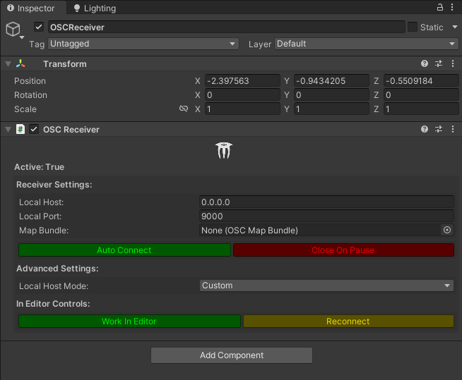

# Using with Unity

This guide will show you how to use `trackfwd` with Unity to receive tracking data and apply it to an object in your scene. This will allow you to support Vive/Tundra trackers without adding support for SteamVR to your project.

## Prerequisites

We will be using the [extOSC](https://github.com/Iam1337/extOSC) package to receive OSC messages in Unity. You can follow the [installation](https://github.com/Iam1337/extOSC?tab=readme-ov-file#installation) step on its repository.

## Setting up the OSC Receiver

First, you need to create an empty GameObject in your scene and attach the `OSCReceiver` component to it. From there, you can configure the `OSCReceiver` component to listen on the desired port and address.



## Creating the TrackedObject Component

You can now create a new GameObject that will represent the tracked object in your scene. Attach a new script to this GameObject called `TrackedObject`. This script will receive the tracking data from the OSC messages and update the position and rotation of the GameObject accordingly.

Here is an example implementation of the `TrackedObject` script:

```csharp
using UnityEngine;
using UnityEditor;
using extOSC;


/// <summary>
/// A component that updates its position and rotation based on incoming OSC messages from trackfwd. The Calibrate function resets the transform to the world origin.
/// </summary>
public class TrackedObject : MonoBehaviour
{
    [SerializeField]
    float lerpSpeed = 50f;
    Vector3 currentTrackerPosition,
        positionOffset = Vector3.zero,
        offsetTrackerPosition;
    Quaternion currentTrackerRotation,
        rotationOffset = Quaternion.identity,
        offsetTrackerRotation;
    OSCReceiver oscReceiver;
    OSCBind bind;

    void Start()
    {
        oscReceiver = FindObjectOfType<OSCReceiver>();
        if (oscReceiver == null)
        {
            Debug.LogError("No OSC receiver was found in the scene. Disabling the TrackedObject component");
            gameObject.SetActive(false);
            return;
        }

        // Register the callback function to be called when an OSC message is received
        bind = oscReceiver.Bind("/tracker/0", OnMessageReceived);
    }

    void Update()
    {
        // Smoothly move the object to the desired position and rotation
        transform.rotation = Quaternion.Lerp(transform.rotation, offsetTrackerRotation, Time.deltaTime * lerpSpeed);
        transform.position = Vector3.Lerp(transform.position, offsetTrackerPosition, Time.deltaTime * lerpSpeed);
    }

    /// <summary>
    /// Callback function that is called when an OSC message is received. Parses the message and calculates the desired position and rotation of the tracked object with the offset applied.
    /// </summary>
    /// <param name="message">
    /// The OSC message that was received. /tracker/0 should be sending a message with 7 float values: x, y, z, qx, qy, qz, qw
    /// </param>
    void OnMessageReceived(OSCMessage message)
    {
        // Parse the values from the incoming OSC messages
        currentTrackerPosition = new Vector3(message.Values[0].FloatValue, message.Values[1].FloatValue, message.Values[2].FloatValue);
        currentTrackerRotation = new Quaternion(message.Values[3].FloatValue, message.Values[4].FloatValue, message.Values[5].FloatValue, message.Values[6].FloatValue);

        // Calculate the offset position and rotation
        offsetTrackerRotation = rotationOffset * currentTrackerRotation;
        offsetTrackerPosition = rotationOffset * currentTrackerPosition - positionOffset;
    }


    /// <summary>
    /// Calibrates the position and rotation of the tracked object to the world origin. This function should be called when the tracked object is in a known position and rotation.
    /// </summary>
    public void Calibrate()
    {

        rotationOffset = Quaternion.Euler(0, -currentTrackerRotation.eulerAngles.y, 0);
        positionOffset = rotationOffset * currentTrackerPosition;
        Debug.Log("Tracker calibrated");
    }

    void Unbind()
    {
        if (oscReceiver != null)
        {
            oscReceiver.Unbind(bind);
        }
    }
    private void OnDestroy()
    {
        Unbind();
    }
}


```

Optionally, you may want to add the following snippet to your `TrackedObject` script to expose the `Calibrate` function in the Unity Editor:

```csharp
[CustomEditor(typeof(TrackedObject))]
public class TrackedObjectEditor : Editor
{
    public override void OnInspectorGUI()
    {
        base.OnInspectorGUI();

        var trackedObject = (TrackedObject)target;

        // Add a button to calibrate the tracked object from the inspector
        if (GUILayout.Button("Calibrate"))
        {
            trackedObject.Calibrate();
        }
    }
}
```

This will display a handy "Calibrate" button in the inspector for your `TrackedObject` component.

## Running trackfwd

It is recommended to add `trackfwd` to your PATH environment variable so that you can run it from any directory. You can do this by adding the directory containing the `trackfwd` binary to your PATH. Once you have done this, you can run `trackfwd` from the command line with the following command:

```Powershell
trackfwd 9000 --coords unity
```

You can also navigate to the directory containing the `trackfwd` binary and run it from there:

```Powershell
.\trackfwd.exe 9000 --coords unity
```
