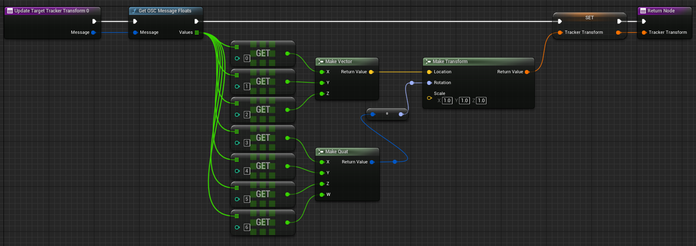

# Using with Unreal Engine

This guide will show you how to use `trackfwd` with Unreal Engine and Blueprints to receive tracking data and apply it to an object in your scene.

## Starting the OSC Server

In your blueprint, you will need to create an OSC server to receive the tracking data. You can do this by adding the following nodes to your blueprint:


The `Start OSC Server` node will start the OSC server on the specified port and should only be called once (for example, on `Event BeginPlay`). The On OSC Message Received event will be triggered whenever a message is received on the specified port. For the IP address, you can either use `0.0.0.0` to listen on all available interfaces, or specify a specific IP address to listen on. For the port, you can use any available port, but it should match the port that `trackfwd` is broadcasting on. In this example, we are using port `9000`.

Ths `Is Tracker Transform` collapsed subgraph checks if the incoming OSC message starts with `/tracker/` followed by the index of the desired tracker (in this case, `0`). If the message matches the expected format, it is passed to the `Update Target Tracker Transform` function.


## Parsing the OSC Message

When an OSC message is received, you will need to parse the message to extract the tracking data. The OSC message format is as follows:

```
/tracker/<index> float float float float float float float
```

There are 7 float values in the message. The first three values are the position of the tracker in meters (`x`,`y`,`z`), and the last four values are the quaternion rotation of the tracker (`qx`, `qy`, `qz`, `qw`). You need to extract these values and build a transform from them. Here is an example of how you can parse the message in Blueprints with our `Update Target Tracker Transform` function:



## Running trackfwd

It is recommended to add `trackfwd` to your PATH environment variable so that you can run it from any directory. You can do this by adding the directory containing the `trackfwd` binary to your PATH. Once you have done this, you can run `trackfwd` from the command line with the following command:

```Powershell
trackfwd 9000 --coords unreal
```

You can also navigate to the directory containing the `trackfwd` binary and run it from there:

```Powershell
.\trackfwd.exe 9000 --coords unreal
```

## Calibrating the Tracker

If you are using the null driver for SteamVR (no HMD or controllers), you may need to calibrate the tracker to match the position and orientation of the object in Unreal Engine. You can do this by moving the tracker to a known position and orientation in the real world and saving the current transform as an offset. You can then apply this offset to the tracker transform in Unreal Engine to align it with the real-world position and orientation. Here is an example that will set the offset transform to the current position and orientation of the tracker so that the pawn will be at the world origin:


## Using the calibrated offset

Once you have calibrated the tracker, you can apply the offset to the tracker transform in Unreal Engine. Here is an example of how you can apply the offset to the tracker transform in Blueprints:


